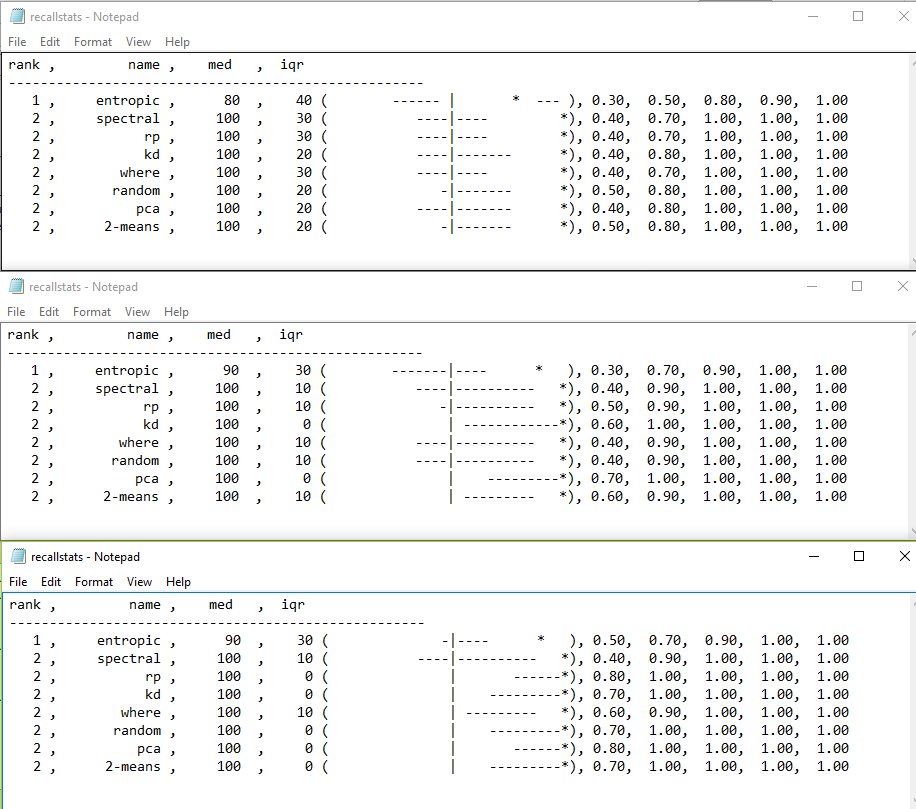
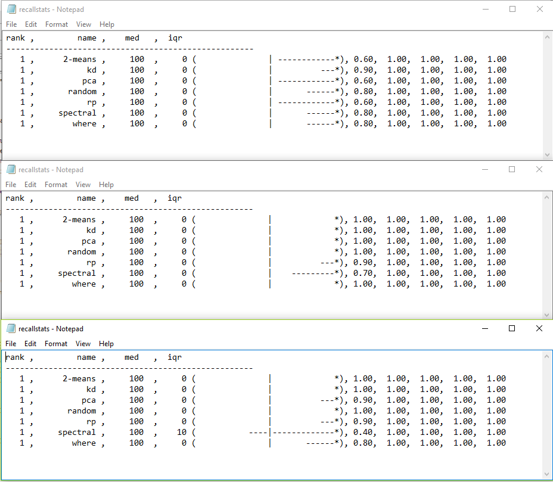
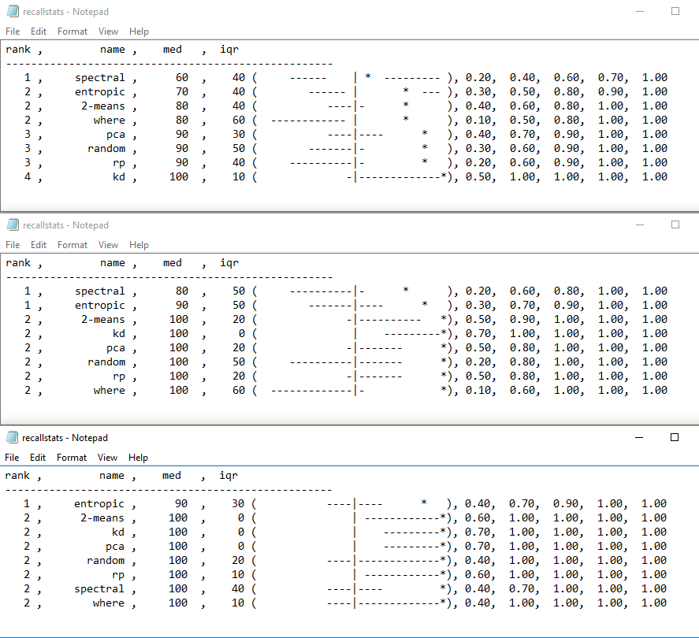
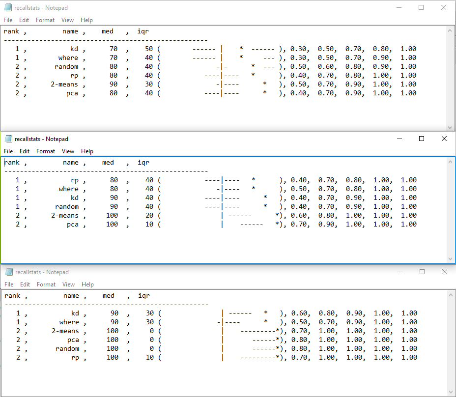
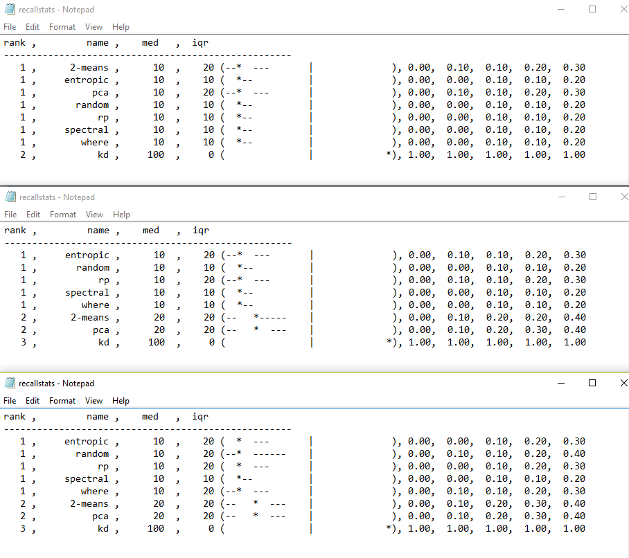
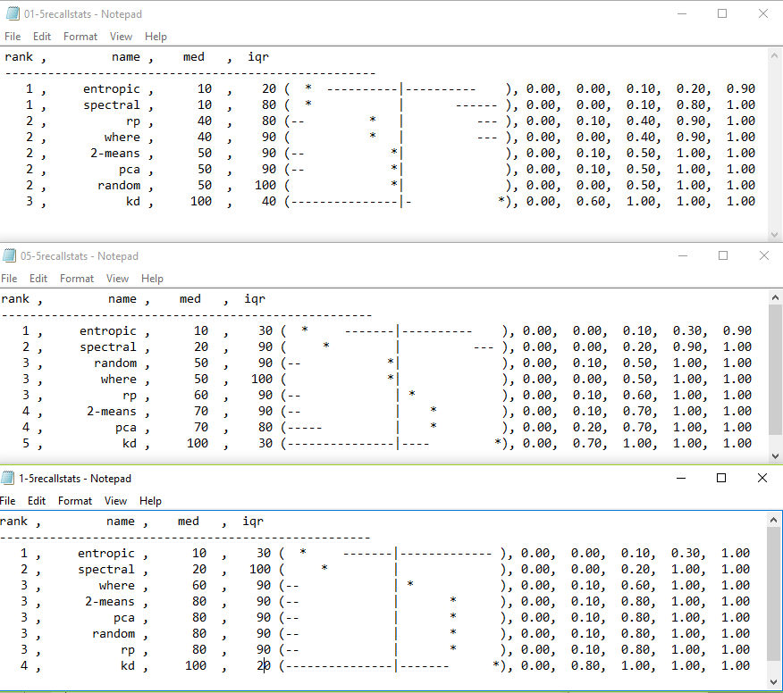

DOING: Examining output from stats.py for meaningful patterns in non-recall indicators.

DONE: stats.py integrated with my setup, partially automated (generates data automatically, doesn't help analyze).  Examination of recall stats suggests increasing spill rates result in modest improvement in recall median but significant improvement in variation.

TODO: Finish automation of stats.py.  At present, nearly 100 SUMMARY statements are generated per experimental run.  Next step is to automatically compare/suggest which should be examined more closely.  Also, find a better way to output so display is not a screenshot of multiple notepad files lined up manually.

ROADBLOCKS: N/A

ADMIN: N/A

DISCUSSION: End goal of the project

###Report
N.B. All images below compare a tree depth of 5, spill rates 0.01, 0.05, 0.1 (top, middle, bottom) for the dataset indicated.

Overall average recall is given at the end of the document for reference.  It was discovered upon investigation that one of the datasets had errored during its run and all recall values were zero for all cases.  In addition, the dataset created to emulated the situation of the original paper had expected poor behavior (it was made of 300 binary variables).  Below is the average with these two outliers removed.

This behavior and ceiling effects are predominantly due to a Mccabes dataset, for which all methods performed well from the beginning.

On datasets which were not either universally good or universally bad, spill had marginal improvement on the median recall due to ceiling effects.  However the difference in variation between the 0.01 (top) and 0.1 (bottom) spill rates is impressive.  

tomcat and cassandra defect datasets both show this pattern of behavior as well, with Where's iqr dropping from .6 to .1 on cassandra.

Cassandra

Tomcat

The instances in which spill did not have an appreciable effect require further study.  Certain datasets caused problems for all methods (except kd) with and without spill.  This likely represents a problem due to the dataset rather than evidence that spill does not work.  The dataset below is generated to resemble the one used in the original paper, and has 300 binary variables with some structure added by varying their distributions.

Average data without correction

